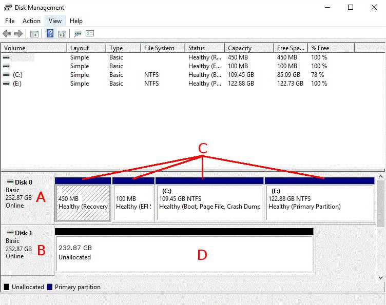

Last change on 2021-05-09 • Created on 2020-03-18 • ID: RO-8FB01

## [](https://docs.hetzner.com/robot/dedicated-server/raid/windows-server-software-raid/#introduction)Introduction

The following guide describes how to manually setup a drive mirroring (RAID1) in a Windows operating system.

Servers which have been installed using our automatic Windows installation (available via [Robot](https://docs.hetzner.com/robot)), or ordered with the Windows addon, already have a RAID level 1 configured and running on them. So this guide is just intended for custom Windows installations.

## [](https://docs.hetzner.com/robot/dedicated-server/raid/windows-server-software-raid/#preparation)Preparation

1.  First, please click on the `Windows symbol` in the bottom left corner, or press the `Windows` or `Super` key.
    
2.  Type `diskmgmt.msc` and press the `Enter` key to open the Disk Management Utility.
    
    Please find a quick overview of the utility below: 
    
    -   **A:** Main disk, which contains the operating system
    -   **B:** Second disk, intended to be used for the RAID1 mirroring
    -   **C:** Volumes (means partitions under Windows) on the main disk
    -   **D:** Unallocated space on the second disk
3.  If your second disk already has Volumes on it, please right-click on them and choose `Delete Volume` on all of them.
    
4.  Right-click on the disk which currently contains the operating system and click on `Convert to dynamic disk`.
    
5.  In the dialog that then appears, the main drive should already be selected. Please also select the other drive which you would like to use for the RAID1. Click on `Ok` and confirm.
    
6.  Now you have to determine if your system has been installed in Legacy Mode, or in UEFI Mode. To do this, please click on the `Windows symbol` in the bottom left corner, or press the `Windows` or `Super` key.
    
7.  Type `msinfo32.exe` and press the `Enter` key to open the System Information window.
    
8.  In the right side of the window, you should see the `BIOS MODE` entry, which has the correct mode (`Legacy` or `UEFI`) as its value. If you cannot find this entry, the system is installed in the `Legacy` mode. Now, continue below to either "Legacy" or "UEFI".
    

## [](https://docs.hetzner.com/robot/dedicated-server/raid/windows-server-software-raid/#legacy)Legacy

If your system is running in Legacy mode, you should do the following steps on all the Volumes of the main disk. Work on the Volumes from left to right:

1.  Right-click on a Volume and choose `Add mirroring` from the context menu.
    
2.  In the menu that appears, choose the second drive you would like for the RAID1. Then confirm by clicking on `Add mirroring`.
    

Please check that you have correctly added all the Volumes to the mirroring. Also check that the synchronization is running, which is indicated by the reddish colored Volumes and their status information.

## [](https://docs.hetzner.com/robot/dedicated-server/raid/windows-server-software-raid/#uefi)UEFI

Every UEFI system has a UEFI System Volume. This partition cannot be mirrored automatically by Windows; you need to manually copy and configure it on the second drive. Like with Legacy, add the mirroring for the Volumes one by one, from left to right.

-   For all Volumes, that do **not** have the `EFI` label, follow those steps:
    
    1.  Right-click on a Volume and choose `Add mirroring` from the context menu.
        
    2.  In the menu that appears, choose the second drive you would like for the RAID1. Then confirm this by clicking on `Add mirroring`.
        
-   For the UEFI System Volume, please use the following steps:
    
    1.  Create an UEFI System Volume with the same size on the second drive and format it with [FAT32](https://en.wikipedia.org/wiki/File_Allocation_Table). To do this, just right-click on the unallocated space of the second drive, select `New Simple Volume` and follow the dialog.
        
    2.  Copy the UEFI System Volume data from the first drive to the second. To do that, we recommend that you boot the server to the [Rescue System](https://docs.hetzner.com/robot/dedicated-server/troubleshooting/hetzner-rescue-system/) and connect to it via SSH:
        
        -   Locate the correct partitions:
            
            This command will list the partitions of all drives. There, please search for two UEFI partitions on both drives which you might identify by their sizes and filesystem ([FAT32](https://en.wikipedia.org/wiki/File_Allocation_Table)) and combine the disk identifiers (`/dev/sdX`) with the correct numbers of the partitions.
            
            _Example:_
            
            ```
            parted -l
            Model: WD Enterprise P20691
            Disk /dev/sda: 2000GB
            Sector size (logical/physical): 512B/512B
            Partition Table: msdos
            Disk Flags:
            
            Number  Start   End     Size    Type     File system  Flags
             1      1049kB  101MB   100MB   primary  fat32
             2      102MB   2000GB  1999GB  primary  ntfs
            
            Model: WD Enterprise P20691
            Disk /dev/sda: 2000GB
            Sector size (logical/physical): 512B/512B
            Partition Table: msdos
            Disk Flags:
            
            Number  Start   End     Size    Type     File system  Flags
             1      1049kB  101MB   100MB   primary  fat32
             2      102MB   2000GB  1999GB  primary  ntfs
            ```
            
            In this case, the partitions are `/dev/sda1` and `/dev/sdb1`.
            
        -   Create mount point folders:
            
            ```
            mkdir /mnt/main
            mkdir /mnt/second
            ```
            
        -   Mount the correct UEFI System partitions. (Replace the partitions with the ones you have found):
            
            ```
            mount -t vfat /dev/sda1 /mnt/main -o rw,umask=0000
            mount -t vfat /dev/sdb1 /mnt/second -o rw,umask=0000
            ```
            
        -   Next, copy all the files from the current UEFI System partition to the new one:
            
            ```
            cp -ar /mnt/main/ /mnt/second/
            ```
            
        -   Once you're finished, boot the server back to the installed system:
            

Important note: The UEFI System partition can't be mirrored. The process as described above is therefore always required if you replace a drive or if you have make changes to the bootloader configuration.

Please ensure that you have added all other Volumes to the mirroring. And check that the synchronization is running, which is indicated by the reddish colored Volumes and their status information.

If you face any issues with certain Volumes, or the second Plex (which is a part of a mirrored Microsoft Volume) is not bootable, please see the official [documentation](https://support.microsoft.com/en-us/help/814070/how-to-establish-and-boot-to-gpt-mirrors-on-64-bit-windows).

# References
<https://docs.hetzner.com/robot/dedicated-server/raid/windows-server-software-raid/>